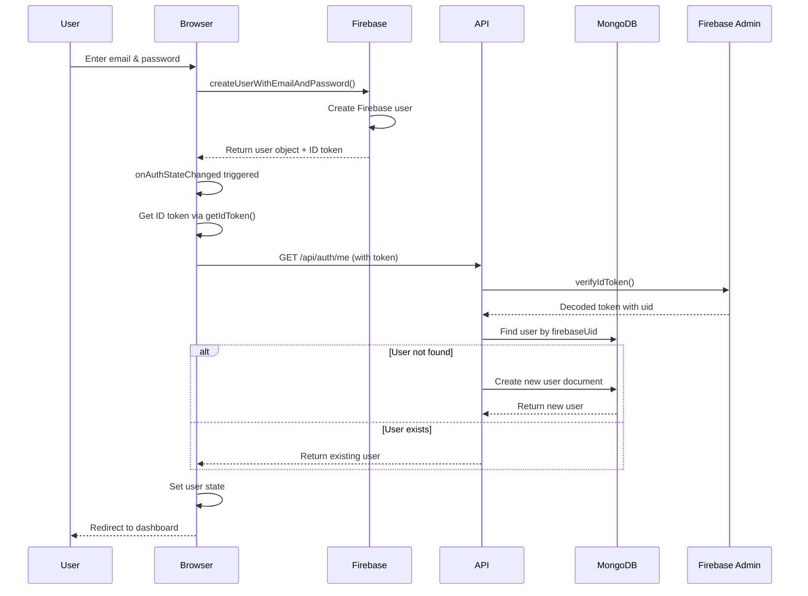
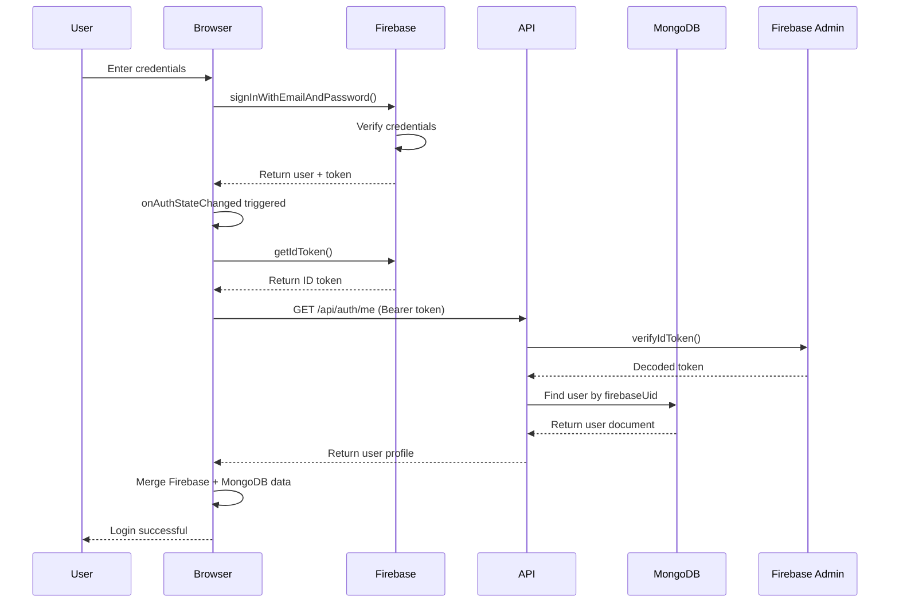
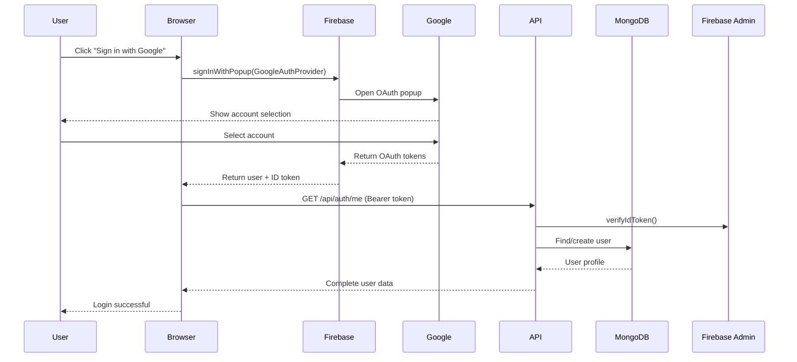
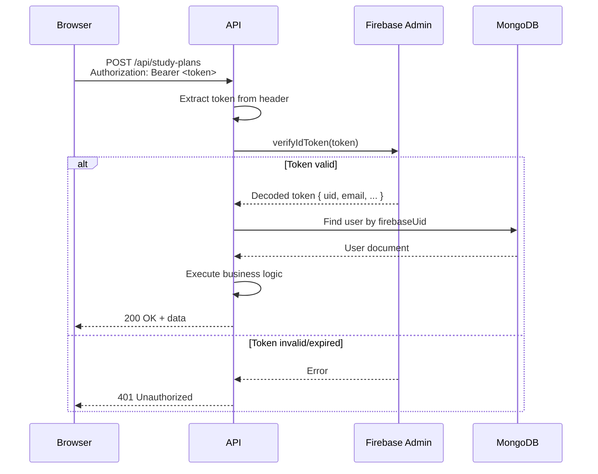
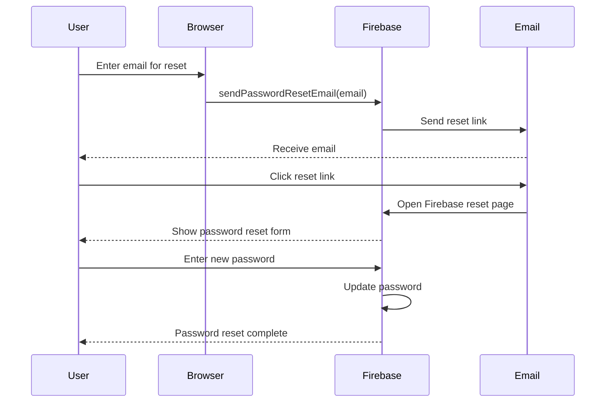
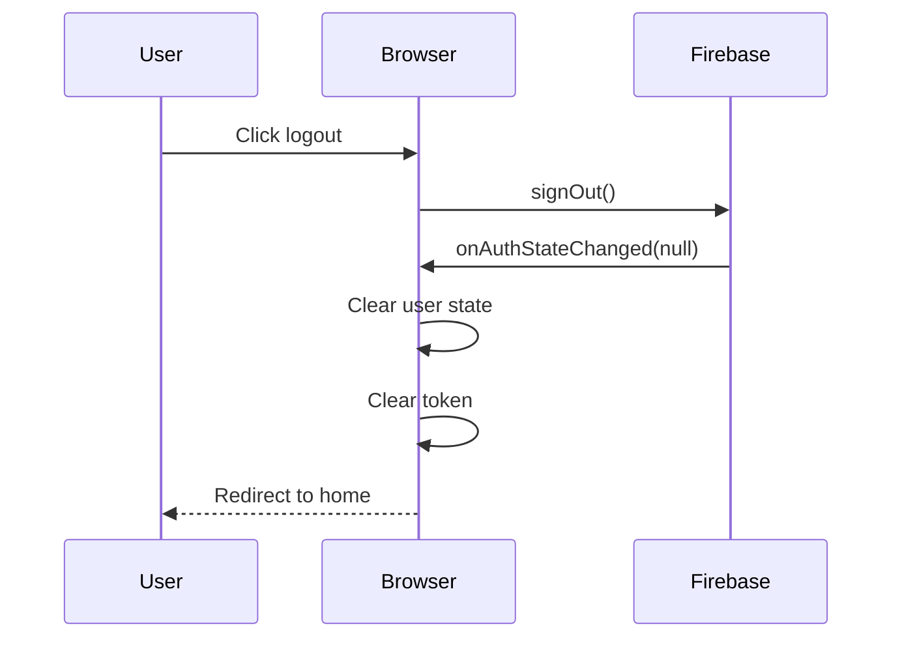

## Overview

Study Sync uses **Firebase Authentication** for user identity management and **MongoDB** for storing user profiles and application data. This hybrid approach provides:

- Secure authentication with industry-standard OAuth providers
- No custom password storage or management
- JWT-based stateless API authentication
- Automatic user provisioning in MongoDB

## Architecture

### Client-Side: Firebase Authentication SDK

**Location**: `src/lib/firebase.js:1`

The client uses Firebase JavaScript SDK to handle:
- Email/password sign-up and sign-in
- Google OAuth sign-in
- Password reset
- Session management
- ID token generation

```javascript
import { initializeApp } from "firebase/app";
import { getAuth } from "firebase/auth";

const firebaseConfig = {
  apiKey: process.env.NEXT_PUBLIC_FIREBASE_API_KEY,
  authDomain: process.env.NEXT_PUBLIC_FIREBASE_AUTH_DOMAIN,
  projectId: process.env.NEXT_PUBLIC_FIREBASE_PROJECT_ID,
  // ... other config
};

const app = initializeApp(firebaseConfig);
const auth = getAuth(app);

export { app, auth };
```

### Server-Side: Firebase Admin SDK

**Location**: `src/lib/firebase-admin.js:1`

The server uses Firebase Admin SDK to:
- Verify ID tokens from client requests
- Decode user information from tokens
- Ensure token authenticity and validity

```javascript
import admin from "firebase-admin";

if (!admin.apps.length) {
  const decoded = Buffer.from(
    process.env.FIREBASE_SERVICE_ACCOUNT_KEY,
    "base64"
  ).toString("utf8");

  const serviceAccount = JSON.parse(decoded);

  admin.initializeApp({
    credential: admin.credential.cert(serviceAccount),
  });
}

export default admin;
```

### MongoDB: User Profile Storage

**Location**: `src/lib/db.js:74`

MongoDB stores:
- User profile data (displayName, photoURL)
- Application-specific settings (notifications, role)
- Relationships (study plans, instances, progress)

## Authentication Flow

### 1. User Registration



**Client Implementation**: `src/providers/AuthProvider.jsx:28`

```javascript
const createUser = (email, password) => {
  return createUserWithEmailAndPassword(auth, email, password);
};
```

**Server Implementation**: `src/lib/auth.js:17`

```javascript
let user = await users.findOne({ firebaseUid: decodedToken.uid });

if (!user) {
  const newUser = schemas.user({
    firebaseUid: decodedToken.uid,
    email: decodedToken.email || "",
    displayName: decodedToken.name || decodedToken.email?.split("@")[0] || "",
    photoURL: decodedToken.picture || "",
  });
  const result = await users.insertOne(newUser);
  user = { ...newUser, _id: result.insertedId };
}
```

### 2. User Login (Email/Password)



**Client Implementation**: `src/app/(auth)/login/page.jsx:15`

```javascript
const handleSignIn = (email, password) => {
  setLoading(true);
  signInUser(email, password)
    .then(() => {
      toast.success("Login successful!");
    })
    .catch((err) => {
      // Error handling...
    });
};
```

**Provider Implementation**: `src/providers/AuthProvider.jsx:23`

```javascript
const signInUser = (email, password) => {
  return signInWithEmailAndPassword(auth, email, password);
};
```

### 3. Google OAuth Login



**Client Implementation**: `src/providers/AuthProvider.jsx:33`

```javascript
const signInWithGoogle = () => {
  const provider = new GoogleAuthProvider();
  provider.setCustomParameters({
    prompt: "select_account",
  });
  return signInWithPopup(auth, provider);
};
```

### 4. Auth State Monitoring

**Location**: `src/providers/AuthProvider.jsx:80`

The `AuthProvider` monitors Firebase auth state and automatically:
1. Detects user login/logout
2. Fetches ID tokens
3. Enriches Firebase user with MongoDB profile
4. Updates React context

```javascript
useEffect(() => {
  const unsubscribe = onAuthStateChanged(auth, async (currentUser) => {
    if (currentUser) {
      // Get ID token for API calls
      const idToken = await currentUser.getIdToken();
      setToken(idToken);

      // Fetch user profile from MongoDB
      try {
        const res = await fetch("/api/auth/me", {
          headers: { Authorization: `Bearer ${idToken}` },
        });

        if (res.ok) {
          const dbUser = await res.json();
          // Merge MongoDB data with Firebase user
          Object.assign(currentUser, dbUser);
          setUser(currentUser);
        }
      } catch (error) {
        console.error("Error fetching user profile:", error);
        setUser(currentUser);
      }
    } else {
      setUser(null);
      setToken(null);
    }
    setLoading(false);
  });

  return () => unsubscribe();
}, []);
```

### 5. API Request Authentication



**Middleware Implementation**: `src/lib/auth.js:4`

```javascript
export async function authenticate(request) {
  try {
    const authHeader = request.headers.get("authorization");
    if (!authHeader || !authHeader.startsWith("Bearer ")) {
      return { error: true, status: 401, message: "No token provided" };
    }

    const token = authHeader.split("Bearer ")[1];
    const decodedToken = await admin.auth().verifyIdToken(token);

    const { users } = await getCollections();
    let user = await users.findOne({ firebaseUid: decodedToken.uid });

    if (!user) {
      // Auto-create user on first API request
      const newUser = schemas.user({
        firebaseUid: decodedToken.uid,
        email: decodedToken.email || "",
        displayName: decodedToken.name || decodedToken.email?.split("@")[0] || "",
        photoURL: decodedToken.picture || "",
      });
      const result = await users.insertOne(newUser);
      user = { ...newUser, _id: result.insertedId };
    }

    return { error: false, user, firebaseUser: decodedToken };
  } catch (error) {
    console.error("Authentication error:", error.message);
    return { error: true, status: 401, message: "Invalid or expired token" };
  }
}
```

**Usage in API Route**: `src/app/api/study-plans/route.js:154`

```javascript
export async function POST(request) {
  const auth = await authenticate(request);
  if (auth.error) return createErrorResponse(auth.message, auth.status);

  // auth.user contains MongoDB user document
  const newPlan = {
    title: data.title,
    createdBy: auth.user._id,
    // ...
  };
}
```

### 6. Optional Authentication

Some routes (like public study plan browsing) support optional authentication to provide personalized features for logged-in users.

**Implementation**: `src/lib/auth.js:43`

```javascript
export async function optionalAuth(request) {
  try {
    const auth = await authenticate(request);
    if (auth.error) return { error: false, user: null, firebaseUser: null };
    return auth;
  } catch {
    return { error: false, user: null, firebaseUser: null };
  }
}
```

**Usage**: `src/app/api/study-plans/route.js:24`

```javascript
export async function GET(request) {
  const auth = await optionalAuth(request);
  // auth.user will be null if not authenticated
  
  if (view === "my" && !auth.user) {
    return createErrorResponse("Authentication required", 401);
  }
}
```

## Client-Side API Calls

### API Helper Functions

**Location**: `src/lib/api.js:17`

```javascript
async function apiRequest(endpoint, method = "GET", token = null, body = null) {
  const headers = {
    "Content-Type": "application/json",
  };

  if (token) {
    headers["Authorization"] = `Bearer ${token}`;
  }

  const options = { method, headers };
  if (body && (method === "POST" || method === "PUT")) {
    options.body = JSON.stringify(body);
  }

  const response = await fetch(`${API_BASE_URL}${endpoint}`, options);
  return await response.json();
}
```

### Example: Create Study Plan

**Location**: `src/lib/api.js:68`

```javascript
export const createStudyPlan = async (data, token) => {
  return apiRequest("/api/study-plans", "POST", token, data);
};
```

**Usage in Component**:

```javascript
import { createStudyPlan } from "@/lib/api";
import useAuth from "@/hooks/useAuth";

const CreatePlanPage = () => {
  const { token } = useAuth();

  const handleSubmit = async (planData) => {
    try {
      const result = await createStudyPlan(planData, token);
      toast.success("Plan created!");
    } catch (error) {
      toast.error(error.message);
    }
  };
};
```

## Security Considerations

### Token Expiration

Firebase ID tokens expire after **1 hour**. The Firebase SDK automatically refreshes tokens, and the `AuthProvider` fetches fresh tokens on each auth state change.

### Token Storage

Tokens are stored in React state (not localStorage) to prevent XSS attacks. The Firebase SDK handles secure token storage internally.

### HTTPS Only

In production, all requests must use HTTPS to prevent token interception.

### Service Account Security

The Firebase service account key is stored as a **base64-encoded environment variable** to prevent accidental commits.

**Location**: `src/lib/firebase-admin.js:10`

```javascript
const decoded = Buffer.from(
  process.env.FIREBASE_SERVICE_ACCOUNT_KEY,
  "base64"
).toString("utf8");

const serviceAccount = JSON.parse(decoded);
```

### Role-Based Access Control

Users have a `role` field (`"user"` or `"admin"`) stored in MongoDB. Protected routes can check this field:

```javascript
const auth = await authenticate(request);
if (auth.user.role !== "admin") {
  return createErrorResponse("Admin access required", 403);
}
```

## Password Reset Flow



**Client Implementation**: `src/providers/AuthProvider.jsx:75`

```javascript
const resetPassword = (email) => {
  return sendPasswordResetEmail(auth, email);
};
```

## Logout Flow



**Client Implementation**: `src/providers/AuthProvider.jsx:50`

```javascript
const logOut = () => {
  return signOut(auth);
};
```

## Environment Variables

### Client-Side (Public)

```bash
NEXT_PUBLIC_FIREBASE_API_KEY=AIza...
NEXT_PUBLIC_FIREBASE_AUTH_DOMAIN=your-project.firebaseapp.com
NEXT_PUBLIC_FIREBASE_PROJECT_ID=your-project
NEXT_PUBLIC_FIREBASE_STORAGE_BUCKET=your-project.appspot.com
NEXT_PUBLIC_FIREBASE_MESSAGING_SENDER_ID=123456789
NEXT_PUBLIC_FIREBASE_APP_ID=1:123456789:web:abc123
```

### Server-Side (Private)

```bash
# Base64-encoded Firebase service account JSON
FIREBASE_SERVICE_ACCOUNT_KEY=eyJ0eXBlIjoic2VydmljZV9hY2NvdW50...
```

To encode your service account:

```bash
cat serviceAccountKey.json | base64 -w 0
```

## Testing Authentication

### Manual Testing

1. **Sign Up**: Create a new account via `/register`
2. **Check MongoDB**: Verify user document created with `firebaseUid`
3. **Make API Request**: Use browser DevTools to inspect `Authorization` header
4. **Check Token**: Decode JWT at [jwt.io](https://jwt.io) to verify contents

### Error Handling

**Location**: `src/app/(auth)/login/page.jsx:26`

```javascript
if (err.code === "auth/user-not-found") {
  errorMessage = "No account found with this email.";
} else if (err.code === "auth/wrong-password") {
  errorMessage = "Incorrect password.";
} else if (err.code === "auth/invalid-email") {
  errorMessage = "Invalid email address.";
}
```

## Summary

**Authentication Architecture**:
- Firebase handles identity and token generation
- MongoDB stores user profiles and app data
- JWT tokens authenticate API requests
- Stateless, scalable, and secure

**Key Files**:
- `src/lib/firebase.js` - Client SDK
- `src/lib/firebase-admin.js` - Server SDK
- `src/lib/auth.js` - Authentication middleware
- `src/providers/AuthProvider.jsx` - React context provider
