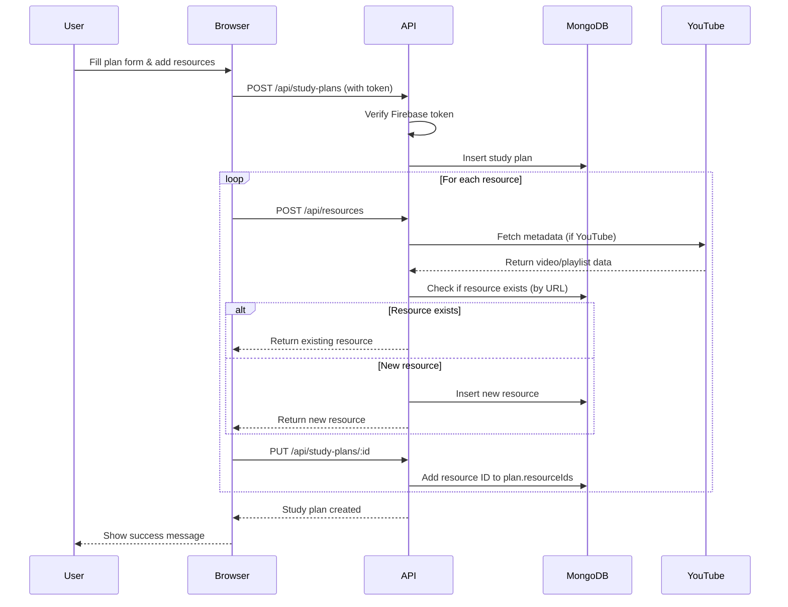
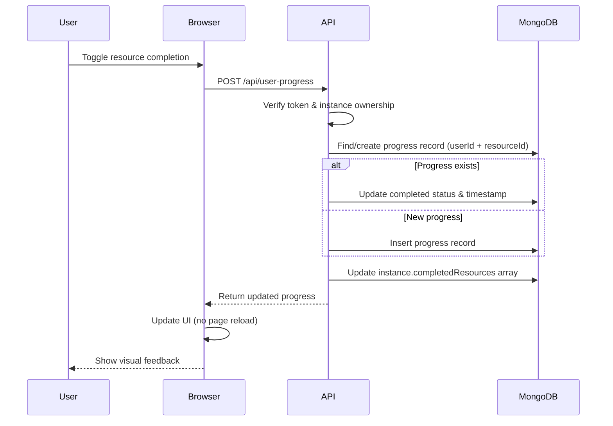

## Introduction

Study Sync is a modern SaaS platform built with Next.js 16.1.0 (App Router) that enables students to create, share, and track study plans with integrated progress monitoring and collaboration features.

## Tech Stack

### Frontend

- **Framework**: Next.js 16.1.0 with App Router architecture
- **UI Library**: React 19.2.3
- **Language**: JavaScript/JSX
- **Styling**: Tailwind CSS 4
- **UI Components**: Radix UI (accessible primitives), Lucide Icons
- **Animations**: Framer Motion 12
- **Drag & Drop**: @dnd-kit library
- **Notifications**: React Hot Toast & Sonner
- **Theme**: next-themes (dark/light mode)

### Backend (Next.js API Routes)

- **Runtime**: Node.js
- **Database**: MongoDB 7.0.0 (Native Driver)
  - Database Name: `study_sync`
  - Connection: MongoDB Atlas with connection pooling
- **Authentication**: Firebase Admin SDK 13.6.0
- **Email Service**: Nodemailer 7.0.12 (Gmail SMTP)

### External Services

- **YouTube Data API v3**: Video and playlist metadata via googleapis 166.0.0
- **Firebase**: Client and server-side authentication
- **Mixpanel**: Analytics and event tracking
- **Vercel**: Hosting, analytics, and cron jobs for scheduled tasks

## Application Architecture

### Next.js App Router Structure

```
src/app/
├── (auth)/                    # Authentication route group
│   ├── login/                # Login page
│   ├── register/             # Registration page
│   └── forget-password/      # Password reset
├── plans/                    # Study plan browsing & details
│   ├── [id]/                # Dynamic plan detail page
│   │   └── edit/           # Plan edit page
│   └── page.jsx            # Browse all public plans
├── my-plans/                 # User's created/shared plans
├── instances/                # Study plan instances
│   ├── [id]/                # Instance detail with progress
│   └── page.jsx            # All user instances
├── create-plan/              # Plan creation wizard
├── dashboard/                # User dashboard with stats
├── profile/                  # User profile settings
└── api/                      # API Routes (Backend)
    ├── study-plans/         # CRUD for study plans
    ├── instances/           # Instance management
    ├── resources/           # Resource handling
    ├── user-progress/       # Progress tracking
    ├── users/               # User management
    ├── notifications/       # Notification settings
    └── cron/                # Scheduled tasks
```

### Key Architectural Patterns

#### 1. Route Groups

The `(auth)` folder is a route group that shares a common layout without adding the group name to the URL path. This keeps authentication pages visually consistent.

**Location**: `src/app/(auth)/layout.jsx:1`

#### 2. API Routes as Backend

Next.js API routes serve as the backend, handling:
- Database operations
- Authentication verification
- External API integrations (YouTube, email)
- Business logic

**Example**: `src/app/api/study-plans/route.js:1`

#### 3. Server-Side Rendering (SSR)

Pages leverage Next.js App Router's server components for optimal performance and SEO.

## Core Components

### Database Layer

**Connection Management** (`src/lib/mongodb.js:1`)
```javascript
import { MongoClient } from "mongodb";

if (process.env.NODE_ENV === "development") {
  // In development, use global variable to preserve connection across hot reloads
  if (!global._mongoClientPromise) {
    client = new MongoClient(MONGODB_URI, options);
    global._mongoClientPromise = client.connect();
  }
  clientPromise = global._mongoClientPromise;
} else {
  // In production, create a new client
  client = new MongoClient(MONGODB_URI, options);
  clientPromise = client.connect();
}
```

**Collection Access** (`src/lib/db.js:9`)
```javascript
export async function getCollections() {
  const db = await getDb();
  
  return {
    users: db.collection("users"),
    studyPlans: db.collection("studyplans"),
    instances: db.collection("instances"),
    resources: db.collection("resources"),
    userProgress: db.collection("userprogresses"),
    reviews: db.collection("reviews"),
  };
}
```

### Authentication Layer

**Client-Side** (`src/providers/AuthProvider.jsx:1`)
- Firebase Authentication SDK for user sign-in/sign-up
- Monitors auth state changes
- Fetches and caches ID tokens for API requests
- Enriches Firebase user with MongoDB profile data

**Server-Side** (`src/lib/auth.js:4`)
- Verifies Firebase ID tokens using Firebase Admin SDK
- Auto-creates MongoDB user records on first login
- Provides authentication middleware for API routes

### Client-Server Communication

**API Client** (`src/lib/api.js:1`)
```javascript
async function apiRequest(endpoint, method = 'GET', token = null, body = null) {
  const headers = {
    'Content-Type': 'application/json',
  };
  
  if (token) {
    headers['Authorization'] = `Bearer ${token}`;
  }
  
  const response = await fetch(`${API_BASE_URL}${endpoint}`, options);
  // ... error handling
}
```

## Data Flow

### Creating a Study Plan



### Tracking Progress



## Key Architectural Decisions

### 1. Global Resource Pool

**Problem**: Prevent duplicate resources when the same YouTube video or PDF is used across multiple study plans.

**Solution**: Resources are stored once in the `resources` collection with a unique URL index. Study plans reference resources by ObjectId.

**Implementation**: `src/app/api/resources/route.js:238`
```javascript
const existingResource = await resources.findOne({ url: resourcesToCreate[0].url });

if (existingResource) {
  return createSuccessResponse({
    message: "Resource already exists",
    resource: existingResource,
    isNew: false,
  }, 200);
}
```

### 2. Instance Snapshot Pattern

**Problem**: Users want instances independent from plan changes (e.g., creator removes resources).

**Solution**: When creating an instance, snapshot the plan's current `resourceIds` array into `instance.snapshotResourceIds`.

**Implementation**: `src/app/api/instances/route.js:174`
```javascript
const snapshotResourceIds = plan.resourceIds || [];

const newInstance = {
  userId: auth.user._id,
  studyPlanId: planId,
  snapshotResourceIds: snapshotResourceIds, // Snapshot at creation time
  // ... other fields
};
```

### 3. Global Progress Tracking

**Problem**: Users may complete a resource in one instance but want it marked complete everywhere.

**Solution**: Progress is tracked globally per `(userId, resourceId)` pair with a unique compound index, not per instance.

**Implementation**: `src/app/api/user-progress/route.js:75`
```javascript
// Progress is GLOBAL per user per resource (not per instance)
const existingProgress = await userProgress.findOne({
  userId: auth.user._id,
  resourceId: resId,
});
```

**Index**: `src/lib/db.js:60`
```javascript
await collections.userProgress.createIndex(
  { userId: 1, resourceId: 1 },
  { unique: true }
);
```

### 4. Connection Pooling in Development

**Problem**: Next.js hot reloading creates multiple MongoDB connections, exhausting the connection pool.

**Solution**: Cache the MongoDB client promise in a global variable during development.

**Implementation**: `src/lib/mongodb.js:18`

### 5. Authentication Token Flow

**Problem**: Secure API access without session management complexity.

**Solution**: Use Firebase ID tokens (JWT) in `Authorization: Bearer` header, verified server-side with Firebase Admin SDK.

**Implementation**: `src/lib/auth.js:11`

## Environment Variables

```bash
# MongoDB
MONGODB_URI=mongodb+srv://...

# Firebase Client (Public)
NEXT_PUBLIC_FIREBASE_API_KEY=...
NEXT_PUBLIC_FIREBASE_AUTH_DOMAIN=...
NEXT_PUBLIC_FIREBASE_PROJECT_ID=...

# Firebase Admin (Server)
FIREBASE_SERVICE_ACCOUNT_KEY=<base64 encoded JSON>

# External APIs
YOUTUBE_API_KEY=...
GMAIL_USER=...
GMAIL_APP_PASSWORD=...

# App Config
NEXT_PUBLIC_APP_URL=http://localhost:3000
CRON_SECRET=...
```

## Performance Considerations

### Database Indexes

All collections have strategic indexes for common query patterns:
- Users: `firebaseUid`, `email` (unique)
- Study Plans: `createdBy`, `isPublic`, `courseCode`, `sharedWith.userId`
- Instances: `userId`, `studyPlanId`, compound `(userId, studyPlanId)`
- Resources: `url` (unique), `type`
- User Progress: `userId`, `resourceId`, compound `(userId, resourceId)` (unique)

**Reference**: `src/lib/db.js:35`

### Client-Side Optimizations

- Server Components for initial rendering
- Client Components only where interactivity needed
- Framer Motion for smooth, GPU-accelerated animations
- Optimistic UI updates for progress toggling

## Deployment

The application is deployed on **Vercel** with:
- Automatic CI/CD from Git
- Edge Network distribution
- Vercel Analytics for performance monitoring
- Vercel Cron for scheduled email reminders

**Cron Configuration** (`vercel.json`):
```json
{
  "crons": [{
    "path": "/api/cron/reminders",
    "schedule": "0 * * * *"
  }]
}
```

## Next Steps

- [Database Schema](/architecture/database-schema) - Detailed collection schemas
- [Authentication Flow](/architecture/authentication) - In-depth auth implementation
- [Resource Pool](/architecture/resource-pool) - De-duplication strategy
