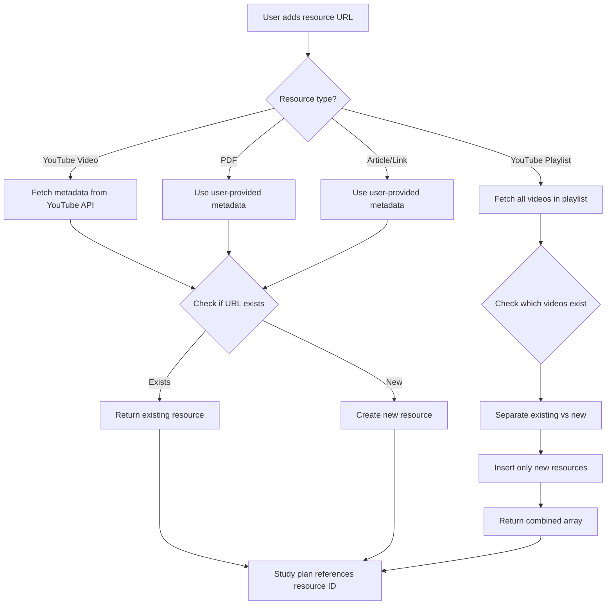

## Overview

The **Global Resource Pool** is a core architectural pattern in Study Sync that prevents duplication when the same resource (YouTube video, PDF, article, etc.) is used across multiple study plans.

## The Problem

Without de-duplication:
- Same YouTube video added to 10 different study plans → 10 duplicate database entries
- Wasted storage space
- Inconsistent metadata (e.g., video title updated in one plan but not others)
- Difficulty tracking which resources are most popular

## The Solution: URL-Based De-duplication

### Architecture

```
┌─────────────────┐
│  Study Plan A   │────┐
└─────────────────┘    │
                       │       ┌──────────────────────┐
┌─────────────────┐    ├──────>│  Global Resources    │
│  Study Plan B   │────┤       │  Collection          │
└─────────────────┘    │       │                      │
                       │       │  - Unique by URL     │
┌─────────────────┐    │       │  - Shared metadata   │
│  Study Plan C   │────┘       │  - Referenced by ID  │
└─────────────────┘            └──────────────────────┘
```

### How It Works

1. **User adds a resource** to their study plan
2. **System checks** if a resource with that URL already exists
3. **If exists**: Return the existing resource ObjectId
4. **If new**: Create resource, then return its ObjectId
5. **Study plan** stores only the resource ObjectId in its `resourceIds` array

## Implementation

### Database Schema

**Collection**: `resources`

**Location**: `src/lib/db.js:54`

```javascript
{
  _id: ObjectId,
  url: String,        // UNIQUE INDEX - de-duplication key
  title: String,
  type: String,       // "youtube-video", "pdf", "article", etc.
  metadata: Object,   // Type-specific metadata
  createdAt: Date,
  updatedAt: Date
}
```

**Unique Index**:

```javascript
await collections.resources.createIndex({ url: 1 }, { unique: true });
```

This ensures MongoDB prevents duplicate URLs at the database level.

### API Endpoint: Create or Get Resource

**Endpoint**: `POST /api/resources`

**Location**: `src/app/api/resources/route.js:84`

#### Flow Diagram



#### Code Implementation

**Single Resource** (`src/app/api/resources/route.js:238`)

```javascript
if (resourcesToCreate.length === 1) {
  // Check if resource already exists
  const existingResource = await resources.findOne({
    url: resourcesToCreate[0].url,
  });

  if (existingResource) {
    // Resource already exists, return it
    return createSuccessResponse({
      message: "Resource already exists",
      resource: existingResource,
      isNew: false,
    }, 200);
  }

  // Create new resource
  const result = await resources.insertOne(resourcesToCreate[0]);
  return createSuccessResponse({
    message: "Resource created successfully",
    resource: { ...resourcesToCreate[0], _id: result.insertedId },
    isNew: true,
  }, 201);
}
```

**Multiple Resources (Playlist)** (`src/app/api/resources/route.js:268`)

```javascript
// Check which resources already exist
const urls = resourcesToCreate.map((r) => r.url);
const existingResources = await resources
  .find({ url: { $in: urls } })
  .toArray();
const existingUrlMap = new Map(existingResources.map((r) => [r.url, r]));

// Separate new and existing resources
const newResources = [];
const finalResources = [];

for (const resource of resourcesToCreate) {
  const existing = existingUrlMap.get(resource.url);
  if (existing) {
    finalResources.push(existing);  // Use existing
  } else {
    newResources.push(resource);    // Mark for insertion
  }
}

// Insert only new resources
if (newResources.length > 0) {
  const result = await resources.insertMany(newResources);
  const insertedResources = newResources.map((r, i) => ({
    ...r,
    _id: result.insertedIds[i],
  }));
  finalResources.push(...insertedResources);
}

return createSuccessResponse({
  message: `${newResources.length} new resource(s) created, ${existingResources.length} already existed`,
  resources: finalResources,
  newCount: newResources.length,
  existingCount: existingResources.length,
}, 201);
```

## Resource Types

### 1. YouTube Videos

**Type**: `youtube-video`

**Metadata Fetching**: `src/lib/youtube.js`

**Process**:
1. Extract video ID from URL
2. Call YouTube Data API v3 to fetch:
   - Title
   - Duration (in seconds)
   - Thumbnail URL
3. Store metadata in `resource.metadata`

**Example**:

```javascript
{
  _id: ObjectId("..."),
  url: "https://www.youtube.com/watch?v=dQw4w9WgXcQ",
  title: "Introduction to Algorithms",
  type: "youtube-video",
  metadata: {
    duration: 3600,
    videoId: "dQw4w9WgXcQ",
    thumbnail: "https://i.ytimg.com/vi/dQw4w9WgXcQ/maxresdefault.jpg"
  }
}
```

**Implementation**: `src/app/api/resources/route.js:119`

```javascript
if (type === "youtube-video" && url) {
  const ytMetadata = await getVideoMetadata(url);
  finalMetadata = { ...ytMetadata };
  finalTitle = ytMetadata.title || finalTitle;
  
  resourcesToCreate.push({
    type,
    title: finalTitle,
    url,
    metadata: finalMetadata,
    addedBy: auth.user._id,
    createdAt: new Date(),
    updatedAt: new Date(),
  });
}
```

### 2. YouTube Playlists

**Type**: `youtube-playlist` (expanded to individual videos)

**Process**:
1. Extract playlist ID from URL
2. Fetch all videos in playlist via YouTube API
3. Create individual `youtube-video` resources for each video
4. De-duplicate: skip videos already in database

**Implementation**: `src/app/api/resources/route.js:141`

```javascript
else if (type === "youtube-playlist" && url) {
  const playlistId = url.match(/[?&]list=([^&]+)/)?.[1];
  const videos = await getPlaylistVideos(url);

  // Create individual resources for each video
  resourcesToCreate = videos.map((video) => ({
    type: "youtube-video",
    title: video.title,
    url: video.url,
    metadata: {
      duration: video.duration,
      videoId: video.videoId,
      thumbnail: video.thumbnailUrl,
    },
    addedBy: auth.user._id,
    createdAt: new Date(),
    updatedAt: new Date(),
  }));
}
```

### 3. PDF Documents

**Type**: `pdf`

**Metadata** (user-provided):
- `pages`: Number of pages
- `minsPerPage`: Estimated minutes per page (default: 3)

**Example**:

```javascript
{
  _id: ObjectId("..."),
  url: "https://example.com/textbook.pdf",
  title: "Data Structures Textbook - Chapter 5",
  type: "pdf",
  metadata: {
    pages: 42,
    minsPerPage: 4
  }
}
```

**Total Time Calculation**: `42 pages × 4 mins = 168 minutes`

**Implementation**: `src/app/api/resources/route.js:172`

```javascript
else if (type === "pdf") {
  if (!title || !pages) {
    return createErrorResponse("Title and pages are required for PDF", 400);
  }

  finalMetadata = {
    pages: parseInt(pages),
    minsPerPage: parseInt(minsPerPage) || 3,
  };

  resourcesToCreate.push({ type, title, url, metadata: finalMetadata, ... });
}
```

### 4. Articles

**Type**: `article`

**Metadata**:
- `estimatedMins`: User-estimated reading time

**Example**:

```javascript
{
  _id: ObjectId("..."),
  url: "https://blog.example.com/understanding-binary-trees",
  title: "Understanding Binary Trees",
  type: "article",
  metadata: {
    estimatedMins: 15
  }
}
```

### 5. Google Drive & Custom Links

**Types**: `google-drive`, `custom-link`

**Metadata**: Optional `estimatedMins`

**Implementation**: `src/app/api/resources/route.js:212`

```javascript
else if (type === "google-drive" || type === "custom-link") {
  const metadata = {};
  if (estimatedMins) {
    metadata.estimatedMins = parseInt(estimatedMins);
  }
  resourcesToCreate.push({ type, title: title || url, url, metadata, ... });
}
```

## Study Plan References

### Storing Resource IDs

**Collection**: `studyplans`

**Field**: `resourceIds: [ObjectId]`

**Location**: `src/lib/db.js:97`

```javascript
studyPlan: (data) => ({
  title: data.title,
  resourceIds: (data.resourceIds || [])
    .map((id) => toObjectId(id))
    .filter(Boolean),
  // ... other fields
})
```

### Adding Resources to Plan

When a user adds a resource:

1. **Create/get resource** via `POST /api/resources`
2. **Update study plan** via `PUT /api/study-plans/:id`
3. **Append resource ID** to `plan.resourceIds`

**Client-side flow**:

```javascript
// 1. Create or get resource
const { resource } = await createOrGetResource({ url, type, ... }, token);

// 2. Add to study plan
await updateStudyPlan(planId, {
  resourceIds: [...existingResourceIds, resource._id]
}, token);
```

### Fetching Plan Resources

**API Endpoint**: `GET /api/study-plans/:id`

**Query**:

```javascript
const plan = await studyPlans.findOne({ _id: planId });
const planResources = await resources
  .find({ _id: { $in: plan.resourceIds } })
  .toArray();
```

**Result**: Full resource objects with metadata

**Sorting**: Resources are returned in the order specified by `plan.resourceIds`

**Implementation**: `src/app/api/resources/route.js:59`

```javascript
switch (sortBy) {
  case "order":
  default:
    // Maintain the order from resourceIds array
    const orderMap = new Map(
      plan.resourceIds.map((id, index) => [id.toString(), index])
    );
    sortedResources.sort((a, b) => {
      const orderA = orderMap.get(a._id.toString()) ?? 999999;
      const orderB = orderMap.get(b._id.toString()) ?? 999999;
      return orderA - orderB;
    });
    break;
}
```

## Benefits of Global Resource Pool

### 1. Storage Efficiency

**Before**:
```
Plan A: { resources: [{ url: "video1", title: "Intro" }] }
Plan B: { resources: [{ url: "video1", title: "Intro" }] }  // DUPLICATE
Plan C: { resources: [{ url: "video1", title: "Intro" }] }  // DUPLICATE
```

**After**:
```
Resources: [{ _id: "r1", url: "video1", title: "Intro" }]  // Stored once
Plan A: { resourceIds: ["r1"] }
Plan B: { resourceIds: ["r1"] }
Plan C: { resourceIds: ["r1"] }
```

### 2. Metadata Consistency

If YouTube video title changes, one database update affects all study plans.

### 3. Analytics Potential

- Find most popular resources (count references)
- Track which resources appear in successful study plans
- Recommend resources based on patterns

**Example Query**:

```javascript
// Find most-referenced resources
const popularResources = await studyPlans.aggregate([
  { $unwind: "$resourceIds" },
  { $group: { _id: "$resourceIds", count: { $sum: 1 } } },
  { $sort: { count: -1 } },
  { $limit: 10 }
]);
```

### 4. Bulk Operations

When importing a playlist with 50 videos:
- Check all 50 URLs against database in one query
- Insert only new videos (maybe 10 are already in DB)
- Save API quota and processing time

## Edge Cases

### 1. Same Video, Different URLs

**Problem**: `youtube.com/watch?v=abc` vs `youtu.be/abc` are the same video but different URLs.

**Solution**: Normalize URLs before storage (future enhancement).

### 2. URL Changes

**Problem**: Video moves to a different URL.

**Current**: Creates a new resource. Old resource remains orphaned.

**Future**: Implement URL redirect detection or manual merge tools.

### 3. Deleted Resources

**Problem**: YouTube video is deleted, but resource still in DB.

**Current**: Resource remains, but video is inaccessible.

**Future**: Periodic validation job to check resource availability.

## Duration Calculation

**Helper Function**: `src/lib/db.js:156`

```javascript
export function getResourceTotalTime(resource) {
  if (resource.type === "youtube-video") {
    return resource.metadata?.duration || 0;  // seconds
  } else if (resource.type === "pdf") {
    return (resource.metadata?.pages || 0) * (resource.metadata?.minsPerPage || 0);
  } else if (resource.type === "article" || resource.type === "google-drive" || resource.type === "custom-link") {
    return resource.metadata?.estimatedMins || 0;
  }
  return 0;
}
```

**Usage**: Calculate total study plan duration

```javascript
const totalTime = planResources.reduce((sum, resource) => {
  return sum + getResourceTotalTime(resource);
}, 0);
```

## Future Enhancements

### 1. Resource Versioning

Track when resource metadata changes:

```javascript
{
  _id: ObjectId,
  url: String,
  currentVersion: ObjectId,
  versions: [
    { title: "Old Title", updatedAt: Date },
    { title: "New Title", updatedAt: Date }
  ]
}
```

### 2. Resource Tagging

```javascript
{
  url: "...",
  tags: ["algorithms", "sorting", "beginner"],
  difficulty: "intermediate"
}
```

### 3. User-Contributed Metadata

Allow users to suggest better titles or durations:

```javascript
{
  url: "...",
  suggestedMetadata: [
    { userId: ObjectId, title: "Better Title", votes: 12 }
  ]
}
```

### 4. Smart Recommendations

```javascript
// Users who used resource A also used:
const recommendations = await studyPlans.aggregate([
  { $match: { resourceIds: resourceA } },
  { $unwind: "$resourceIds" },
  { $group: { _id: "$resourceIds", count: { $sum: 1 } } },
  { $sort: { count: -1 } }
]);
```

## Summary

**Key Principles**:
- Resources are stored **once** in a global pool
- **URL uniqueness** prevents duplicates
- Study plans **reference** resources by ObjectId
- **Automatic de-duplication** on creation
- **Metadata consistency** across all plans

**Files to Review**:
- `src/app/api/resources/route.js` - Resource creation endpoint
- `src/lib/db.js` - Schema definitions and helpers
- `src/lib/youtube.js` - YouTube API integration
